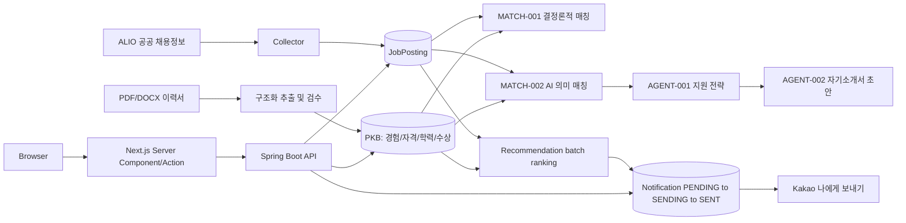

# CareerOps

> 공공기관·금융권 채용공고 수집부터 개인 경험 기반 매칭, 지원 관리,
> AI 지원 전략과 자기소개서, 카카오 알림까지 하나의 흐름으로 연결한
> 개인 채용 운영(Career Operations) 플랫폼입니다.

**핵심 흐름**: ALIO 수집 → 개인 지식베이스(PKB) → 매칭(적합도) → AI 지원 전략 → 지원 관리 → 카카오 알림

---

### 목차

1. [서비스 소개](#서비스-소개)
2. [문제 정의](#문제-정의)
3. [핵심 기능](#핵심-기능)
4. [시스템 아키텍처](#시스템-아키텍처)
5. [기술 스택](#기술-스택)
6. [설계](#설계)
7. [트러블슈팅](#트러블슈팅)
8. [AI 비용 및 실패 대응](#ai-비용-및-실패-대응)
9. [Kakao 실제 E2E](#kakao-실제-e2e)
10. [주요 API / 사용자 흐름](#주요-api--사용자-흐름)
11. [테스트 및 검증](#테스트-및-검증)

---

## 서비스 소개

CareerOps는 공공기관·공기업·금융권 채용공고를 자동으로 모아 오고, 사용자가 입력한
경력/자격/학력/수상 데이터(PKB)와 견주어 적합도를 계산하며, 실제 지원 과정(등록·전형
관리)까지 한 화면에서 관리할 수 있게 만든 개인 프로젝트입니다. 여기에 더해 AI가
지원 전략과 자기소개서 초안을 제시하고, 놓치기 쉬운 추천 공고를 카카오톡으로
알려줍니다.

## 문제 정의

취업 준비 과정에서 실제로 반복되는 문제를 하나씩 시스템으로 옮겼습니다.

- 채용공고가 여러 채널(공공기관 채용정보시스템 등)에 흩어져 있어 매번 수동으로
  탐색해야 한다 → **ALIO 자동 수집**으로 해결
- 공고 요구사항과 내 경험의 연결을 매번 사람이 판단해야 한다 → **매칭 엔진**(빠른
  1차 판단 + AI 기반 심층 분석)으로 구조화
- AI로 분석 결과를 만들어도, 그 결과가 실제 지원 관리와 분리돼 있으면 다시 수작업이
  필요하다 → 매칭·전략·초안 결과를 **지원 등록/전형 관리와 같은 화면**에 연결
- 지원 이후 전형 일정과 상태가 메모장이나 엑셀에 흩어진다 → **Application/Stage
  CRUD**로 구조화
- 괜찮은 공고를 발견해도 매번 다시 들어가 확인해야 한다 → **추천 결과를 저장**하고
  **카카오톡으로 전달**

## 핵심 기능

- **채용공고 수집** — ALIO 목록/상세 조회, 중복 방지(`source`+`external_id` UNIQUE),
  주기적 자동 수집(6시간 간격)
- **개인 지식베이스(PKB)** — 경험/자격증/학력/수상 CRUD, PDF/DOCX 이력서 업로드 후
  구조화 추출(승인 전 검수 단계 포함)
- **공고 매칭** — 결정론적(deterministic) 1차 매칭 + Claude 기반 의미(semantic) 매칭
- **AI 지원 분석** — 지원 전략 분석(강조할 경험/리스크 정리), 자기소개서 초안(문항별)
- **지원 관리** — JobApplication/ApplicationStage CRUD, 상태 변경, 전형 타임라인
- **추천 · 알림 · 자동화** — 배치 추천 랭킹, 알림 영속화, 카카오톡 "나에게 보내기",
  두 개의 독립 스케줄러(기본 비활성)
- **Frontend** — Dashboard/Jobs/Applications/Career/Notifications, Next.js Server
  Component/Server Action 기반

## 시스템 아키텍처



Frontend는 브라우저가 Spring Boot API를 직접 호출하지 않고 Next.js 서버(Server
Component 조회, Server Action 쓰기)를 경유합니다. 덕분에 Backend에 별도 CORS 설정을
추가하지 않고도 두 서버를 연결했습니다.

## 기술 스택

| 영역 | 구성 |
|---|---|
| Backend | Java 21, Spring Boot 4.1.0, Spring Data JPA, PostgreSQL 18, Flyway |
| AI | Anthropic Claude(`com.anthropic:anthropic-java` 공식 SDK 직접 사용) |
| Frontend | Next.js 16.3.2, React 19.2.4, TypeScript, CSS Modules |
| 문서 처리 | Apache PDFBox, Apache POI(PDF/DOCX 이력서 파싱) |
| Infra | Docker Compose(PostgreSQL, Redis), Vercel(Frontend 배포) |
| 관측 | Micrometer + Prometheus |
| 외부 연동 | Kakao Developers(Talk Message API) |
| 테스트 | JUnit 5(Backend), Node.js `node:test`(Frontend 순수 함수) |

> **참고 — Redis는 현재 미사용**: `docker compose`에 포함되어 연결은 되어 있지만,
> 이 시점 기준 비즈니스 로직에서 실제로 사용하는 곳은 없습니다. 자동화 스케줄러·
> 수집기·추천 배치 모두 분산 락을 검토했지만 "현재는 단일 인스턴스로만 운영된다"는
> 전제하에 도입을 보류했습니다(다중 인스턴스로 확장하는 시점에 재검토 대상).

## 설계

### 🔌 Next.js Server Component / Server Action으로 Backend CORS를 건드리지 않음

프론트가 브라우저에서 직접 `fetch`로 Backend를 호출하면 CORS 설정이 필요해집니다.
대신 조회는 Server Component에서, 쓰기는 Server Action에서 수행해 브라우저와
Backend 사이에 Next.js 서버를 끼워 넣었습니다. `API_BASE_URL`은 서버 전용
환경변수로만 존재하고 브라우저 번들에 노출되지 않습니다.

### 🎯 결정론적 매칭과 AI 의미 매칭의 분리

`GET /api/jobs/{id}/match`(MATCH-001)는 비용 없이 즉시 계산되는 태그/카테고리
기반 점수입니다. 이것만으로는 "정보통신"처럼 넓은 직군 라벨과 "Spring Boot" 같은
구체적 기술 사이의 의미적 연결을 잡아내지 못하는 한계가 실제로 확인되어(아래
[트러블슈팅](#트러블슈팅) 참고), 필요할 때만 호출하는 별도 AI 의미
매칭(MATCH-002)을 병렬로 추가했습니다. 두 점수는 독립적으로 계산되고 응답에
함께 노출됩니다.

### 📬 추천 결과를 먼저 영속화한 뒤 발송을 분리

추천을 계산해서 바로 메시지를 보내는 대신, `JobRecommendationNotification`을
`PENDING` 상태로 먼저 저장합니다. 발송은 별도 단계에서 `PENDING → SENDING`을
원자적(atomic)으로 선점(claim)한 뒤 진행합니다. 이 구조 덕분에 발송 실패를
재시도할 수 있고, 같은 공고를 두 번 알리지 않는 멱등성(idempotency)을 DB
UNIQUE 제약으로 보장합니다.

### ✂️ 외부 AI 호출을 DB 트랜잭션 밖으로 분리

추천/의미매칭/전략분석/초안생성 전부, 후보를 조회하는 짧은 읽기 트랜잭션과
Claude API를 호출하는 긴 I/O 구간을 분리했습니다. 조회 트랜잭션 안에서는
이후 변경되지 않는 불변(immutable) 입력값만 만들고, 실제 외부 호출은
트랜잭션 밖에서 수행합니다.

### 🗂️ Flyway로 스키마 변경 이력 관리

마이그레이션 파일(V1~V17)로 테이블 구조 변화를 코드로 추적합니다. 별도
관리 도구 없이 애플리케이션 기동 시 자동 적용됩니다.

## 트러블슈팅

### 🔍 결정론적 매칭이 놓친 의미적 연결

**문제**
실제 dev DB의 PKB(Spring Boot/Java/AI 관련 경험·자격)로 열려 있는 실제 공고
여러 건을 테스트했더니, "정보통신"처럼 광범위한 직군 카테고리를 가진 공고들이
전부 `overallScore = 0.0`으로 나왔다.

**원인**
결정론적 매칭은 태그/카테고리 문자열 겹침 기반이라, "정보통신"이라는 넓은
라벨과 "Java"/"Spring Boot"/"정보처리기사" 같은 구체적 어휘가 문자열 수준에서
전혀 겹치지 않았다. 반대로 우연히 "연구"라는 조각이 포함된 무관한 공고가
오히려 더 높은 점수를 받는 역전 현상도 함께 확인됐다.

**해결**
기존 결정론적 매칭은 그대로 두고, `JobPosting`의 실제 필드와 승인된 PKB
전체를 Claude structured output으로 의미 비교하는 별도 API(MATCH-002)를
추가했다. 응답에 포함되지 않은 PKB id가 하나라도 나오면 전체 응답을 실패
처리하는 ID 기반 검증으로, 실제로 존재하지 않는 경험을 지어내는 것을
구조적으로 막았다.

**결과**
두 점수(`deterministicScore`/`semanticScore`)가 함께 노출되어, 넓은 카테고리
라벨 뒤에 가려진 의미적 연관성을 놓치지 않으면서도 기존 빠른 판단 경로는
그대로 유지했다.

### ⏳ 추천 계산 중 DB 트랜잭션이 길게 유지되던 문제

**문제**
추천 후보를 조회한 뒤 Claude 응답을 기다리는 동안 read-only 트랜잭션이
계속 열려 있었다. 외부 API 응답 시간이 길어질수록 DB 커넥션 점유 시간도
함께 늘어나는 구조였다.

**원인**
후보 조회와 provider I/O가 하나의 서비스 트랜잭션 안에 있었다.

**해결**
`RecommendationCandidateReader`가 짧은 트랜잭션 안에서 불변 `RecommendationInput`
스냅샷을 만들고, 이후 Claude 호출은 트랜잭션 밖에서 수행하도록 분리했다.
프롬프트에 넣는 PKB도 원문 전체가 아니라 제목/기관/역할/요약/태그만 담은
축약형으로 구성했다.

**결과**
외부 API 응답 시간과 DB 커넥션 점유 시간이 분리됐고, 공개 API 응답 형태는
그대로 유지됐다.

### 🛡️ AI 구조화 응답 검증과 제한적 재시도

**문제**
LLM이 반환하는 구조화 응답이 항상 유효하다고 보장할 수 없다 — 존재하지 않는
공고/PKB id를 참조하거나, 점수가 범위를 벗어나거나, JSON 형식 자체가 깨질 수
있다.

**원인**
구조화 출력이라도 모델 응답은 결정적이지 않고, 검증 실패와 네트워크/provider
자체 오류는 근본적으로 다른 문제다.

**해결**
`UNKNOWN_JOB_ID`/`UNKNOWN_PKB_ID`/`SCORE_OUT_OF_RANGE`/`MALFORMED_RESPONSE`처럼
검증(validation) 실패로 분류되는 오류만 최대 1회 수정 재시도(repair)를 허용하고,
`NETWORK_TIMEOUT`이나 provider 자체 오류는 재시도 대상에서 제외했다. 검증에
실패한 응답은 어떤 경우에도 그대로 저장하거나 사용자에게 전달하지 않는다.

**결과**
잘못된 형태의 응답이 무한 재시도되거나 조용히 통과되는 경로를 차단했다.

### 🔒 알림 중복 발송 방지

**문제**
같은 추천 알림이 동시에 두 번 처리되면 카카오톡이 중복으로 발송될 수 있다.

**원인**
발송 상태 전이(state transition)를 애플리케이션 레벨에서만 관리하면 두 요청이
동시에 "아직 안 보냈다"고 판단할 수 있다.

**해결**
```sql
UPDATE job_recommendation_notifications
SET status = 'SENDING', last_attempt_at = :attemptedAt, failure_code = NULL
WHERE id = :id AND status IN ('PENDING', 'FAILED')
```
이 조건부 UPDATE 한 번으로 `PENDING → SENDING` 전이를 원자적으로 선점한다.
같은 공고에 대한 알림 자체도 `job_posting_id` UNIQUE 제약으로 중복 생성을
막는다. 실제 카카오 API 호출은 이 짧은 상태 전이 트랜잭션 밖에서 수행되고,
`SENT`/`FAILED`로 확정하는 트랜잭션도 별도로 짧게 유지된다.

**결과**
동시 요청이 들어와도 한쪽만 `SENDING`을 선점하고, 외부 API 응답을 기다리는
동안 DB 커넥션을 오래 붙잡지 않는다.

### 🔁 채용공고 중복 수집

**문제**
수동 수집 API와 자동 스케줄러가 동시에 실행되면, 같은 공고(`source` +
`external_id`)가 중복 저장될 수 있었다. 실제로 개발 중 dev DB에서 1,370개
중복 그룹이 생긴 것을 확인했다.

**원인**
"이미 있는지 확인 후 저장"이라는 조회-후-쓰기(check-then-act) 패턴은 두
프로세스가 동시에 실행되면 둘 다 "없다"고 판단해 각자 저장을 시도할 수 있다.

**해결**
`job_postings(source, external_id)`에 DB UNIQUE 제약을 걸고, 저장 시 제약
위반 예외가 발생하면 기존에 저장된 행을 다시 조회해 반환하도록 처리했다.
DB 자체가 최종 중재자가 되어, 애플리케이션 레벨의 타이밍에 의존하지 않게
만들었다.

**결과**
동시 실행 시나리오를 재현하는 테스트로 중복 발생이 없음을 확인했다.

## AI 비용 및 실패 대응

CareerOps는 AI 호출을 "그냥 호출하고 끝"으로 두지 않고, 비용과 실패를 구조적으로
통제하려 했습니다.

- **호출 범위를 좁게 유지** — 결정론적 매칭(MATCH-001)은 AI를 전혀 쓰지 않는
  기본 판단이고, AI 의미 매칭은 필요할 때만 별도로 호출합니다.
- **개별 호출이 아니라 배치 랭킹** — 추천은 공고를 하나씩 개별 호출하지 않고
  한 번의 요청으로 여러 후보를 함께 순위화합니다.
- **축약된 PKB 입력** — 프롬프트에는 경험 원문 전체가 아니라 제목/기관/역할/
  요약/태그로 축약한 표현을 사용합니다.
- **제한적 재시도** — 검증 실패에 한해서만 최대 1회 수정 재시도를 허용하고,
  provider 자체 오류는 재시도하지 않습니다.
- **명시적 timeout** — 기능별로 45초(의미 매칭)~150초(자기소개서 초안) 사이의
  고정 timeout이 설정돼 있습니다.
- **현재 데모는 비용 방지를 위해 fixture 사용** — 공개 배포 환경에서는 AI 심층
  분석/지원 전략/자기소개서 초안이 저장된 예시 결과로 표시됩니다. "완전 무료"가
  아니라 "이번 배포에서는 저장된 예시 결과를 보여준다"는 의미이며, 개발 과정에서는
  실제 Claude API를 호출해 각 기능을 검증했습니다.

## Kakao 실제 E2E

추천 결과를 화면에 보여주는 데서 끝내지 않고, 실제 카카오톡까지 전달되는 흐름을
구현하고 검증했습니다.

- 추천 결과 중 아직 알리지 않은 공고를 `JobRecommendationNotification`(`PENDING`)으로
  먼저 저장합니다.
- 발송 단계에서 `PENDING → SENDING`을 원자적으로 선점한 뒤, 카카오 OAuth
  refresh token으로 access token을 그때그때 재발급합니다(access token은 저장하지
  않습니다 — refresh token만 DB에 영속화되고, 최초 값만 환경변수로 주입됩니다).
- Kakao Talk Message API의 "나에게 보내기"를 호출해 실제 메시지를 전송하고,
  결과를 `SENT`/`FAILED`로 확정합니다.

실제 계정으로 이 흐름 전체를 끝까지 실행해, DB에 `SENT` 상태로 영속화된 발송
이력을 확인했습니다. README나 저장소 어디에도 REST API Key, Client Secret,
refresh token 같은 실제 값은 포함하지 않습니다.

## 주요 API / 사용자 흐름

```
ALIO 수집 → 공고 탐색/검색 → 공고 상세에서 내 경험과 적합도 확인
  → 지원 등록 → 전형 단계 관리 → AI 지원 전략 확인 → 자기소개서 초안 확인
  → 추천 알림 상태 확인(카카오톡 전달 이력 포함)
```

| 영역 | 대표 endpoint |
|---|---|
| 채용공고 | `GET/POST /api/jobs`, `GET /api/jobs/{id}` |
| 수집 | `POST /api/collect/{source}` |
| 지원 관리 | `/api/applications`, `/api/applications/{id}/stages` (CRUD) |
| 개인 지식베이스 | `/api/career/experiences`, `/certifications`, `/educations`, `/awards` (CRUD) |
| PKB Import | `/api/career/imports/documents`, `/batches`, `/candidates` |
| 매칭 | `GET /api/jobs/{id}/match`, `POST /api/jobs/{id}/semantic-match` |
| AI 분석 | `POST /api/jobs/{id}/agent-analysis`, `POST /api/jobs/{id}/application-draft` |
| 추천/알림 | `POST /api/jobs/recommendations`, `/api/notifications/job-recommendations` |

Frontend route는 `/dashboard`, `/jobs`, `/jobs/[id]`, `/applications`,
`/applications/[id]`, `/career`, `/notifications` 7개입니다.

## 테스트 및 검증

- Backend: 트랜잭션 경계·동시성만 전담하는 통합 테스트를 포함해 약 80개의
  테스트 클래스로 구성되어 있습니다.
- Frontend: `node:test` 기반 순수 함수 테스트(포맷팅, 폼 검증, fixture 무결성
  등)가 전부 통과 상태입니다. `npm run build`/`npm run lint`도 함께 유지합니다.
- 실제 로컬 Backend를 띄운 상태에서 각 기능의 End-to-End 흐름(공고 조회부터
  지원 등록, 전형 관리, Career CRUD, AI 인사이트 표시까지)을 수동으로 검증했습니다.
- 구현 이후에는 별도 검토자가 Acceptance Criteria 대비 결과를 독립적으로
  재검증하는 리뷰 절차를 거쳤습니다.
